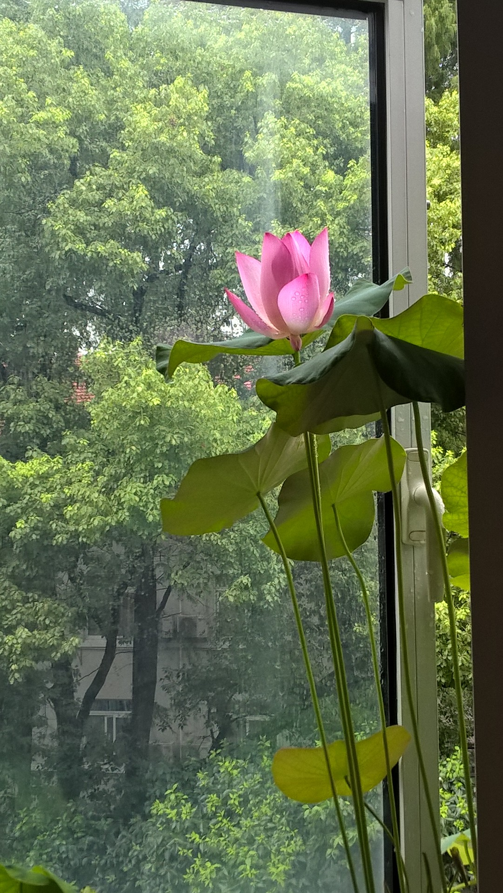

*遥忆十年前春节(2021)*<br>
*2012年春节，堂兄于蜀中办喜酒。予以道阻且长，未归*<br>
蜀中锣鼓催春色，新埠寒江送岁华。<br>
动荡身形恍若梦，怡然髫稚各天涯。<br>
<br>
*老家装了摄像头，连日阴雨破空来(2021)*<br>
耳闻连日雨，人道满禾田。<br>
秋获殊难料，愁眉似旧年？<br>
<br>
*滁河中有泊船，作容身所。暮色主人归(?)*<br>
青衣收落照，翠桨摇风粼。<br>
下括乌篷里，彩灯华夏临。<br>
<br>
*秋日离沪之宁（2018）*<br>
虽无庾信恸，犹有药堂愁。<br>
渺渺烟波路，秋行一叶舟。<br>
<br>
*路行所见（2015）*<br>
虬枝结白石，老树满苍苔。<br>
松鼠衔红走，惊风动地来。<br>
注：白，中古音/bak/。石，中古音“介”。<br>
<br>
（2017）<br>
偏怜最小其休论，销酒玉容君看回：<br>
```{r, out.height="30%", out.width="30%", echo=FALSE}

```
